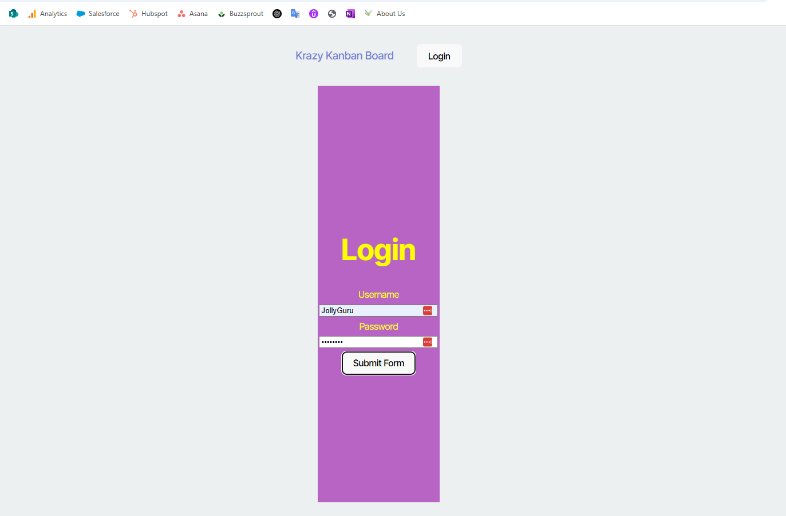
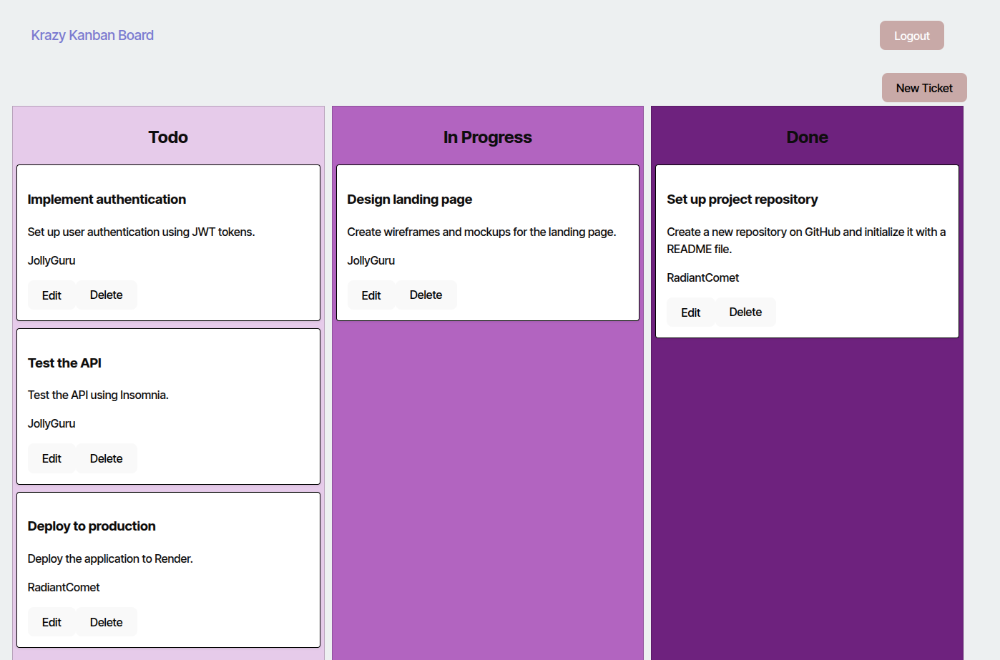

# KabanBoard - Task Management App

## Project
KabanBoard is a task management application based on the Kanban system. It allows users to sign up, log in, and manage tasks visually through status columns (pending, in progress, completed).

---
### Installation and Configuration
### Clone the repository
bash
git clone https://github.com/your-username/kabanboard.git
cd kabanboard-main

### Set up environment variables
Create a `.env` file in the `server/` 
In `client/`, create `.env`:

### Install dependencies
Run in both folders:
bash
cd server && npm install
cd ../client && npm install

The application will be available at `http://localhost:3000`

### Images

